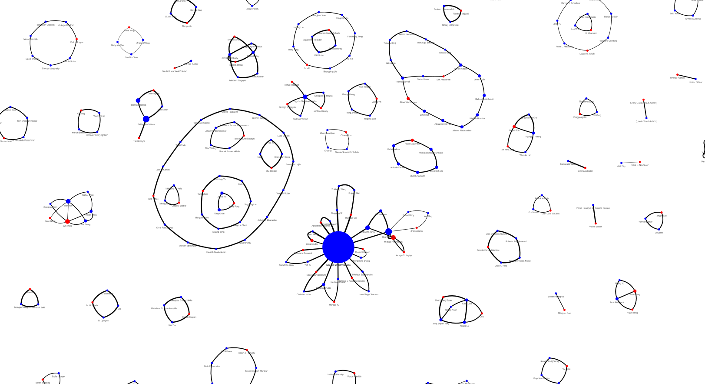

### An Easy Way to Scrape Scientifc Publications from Arxiv and Visualize their Connectivity





# Installation

### 1. Create a virtual enviroment

```
virtualenv --python=<path_to_python> <enviroment_name>
cd <enviroment_name>
Scripts/activate
```

### 2. Download the requirements

#### Navigate to the cloned GitHub repository and run

```
pip install -r requirements.txt
```

# Usage

```
python main.py --input<inputs_separated_by_commas>(string) --range <earliest_latest>(yyyymmdd_yymmdd) --max <max_number_of_articles>(int)
```

#### Examples:

Only a lowe bound on the date:
```
python main.py --input Physics_Informed_Machine_learning,PINN,PIML --range 20180101 --max 100
```
```
python main.py --input PINN,PIML --range 20180101_20220501 --max 20
```
No restrictions in the range:
```
python main.py --input PIML --max 100
```

make sure to use "_" instead of a space. Also make sure to include a folder called "papers" in the repository before using it. Furthermore it appears that the Arxiv serveres only allow a limited number of searched from a certain IP address in a windows of time. So if the search does not result in any publications being downloaded this might be the issue. Furthermore if the <max_number_of_articles> is too small and the daterange <earliest_latest> is too small there might be issues with getting results. <br />
note: All the arxiv articles are sorted by relevance.

# Results
This will create three files:

1. "Network.html" : Open this file with your browser to see a visual representation of all the papers
   
    **Red Node**     = First Author of atleast one paper <br />
    **Blue Node** = Never the first Author <br />
    **Size of the Node** = the larger means more publication. Hover over the node to see the exact number <br />
    **Thickness of Edge** = the thicker the edge the more recent the publication. Hover over the edge to see the name of the publication/s <br />
   


2. "Overview.xlsx" : To see a summary of all the articles. columns = ['Authors', 'Title', 'Date', 'Summary', 'URL', 'Query']

3. "PublicationFrequency.png" : A histogram of the frequency of articles versus the years.
4. In the folder "papers" you will find all corresponding pdfs.

